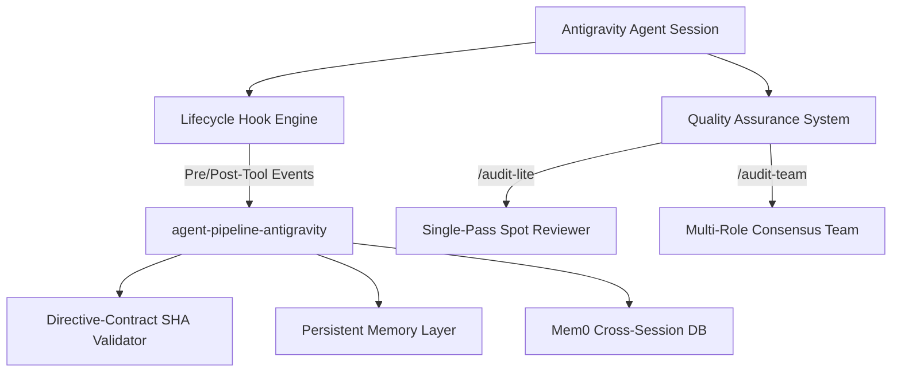

# Antigravity Agent Pipeline Suite

A premium suite of native plugins for the **Antigravity** agent, bringing bulletproof multi-stage orchestration, human-in-the-loop validation, memory persistence, and deep automated auditing to your software development workflows.

This monorepo consolidates two distinct, powerful plugins:

1. **`agent-pipeline-antigravity`**: A multi-stage orchestration engine featuring 11 lifecycle hooks, persistence-layer memory, directive-contract gates, and Mem0 integration for cross-session continuity.
2. **`audit-skills-antigravity`**: A quality-assurance plugin exposing rapid spot audits (`audit-lite`) and multi-role team reviews (`audit-team`).

---

## Suite Architecture Overview



---

## Directory Structure

```
agent-pipeline-antigravity-suite/
├── README.md                 # Project Overview & Quick Start
├── USER-MANUAL.md            # Detailed User Manual & Architecture Diagrams
├── docs/                     # Interactive GitHub Pages Landing Page
│   ├── index.html
│   └── styles.css
└── plugins/                  # Standalone Antigravity Plugins
    ├── agent-pipeline-antigravity/ # Orchestration engine & hooks plugin
    └── audit-skills-antigravity/   # Auditing & quality assurance plugin
```

---

## Plugin Breakdown & Features

### 1. Orchestration: `agent-pipeline-antigravity`
* **Multi-Stage Orchestration (`/run`)**: Runs structured tasks across multiple roles (Drafter, Researcher, Planner, Executor, Verifier, Critic, Judge).
* **Strict Drift Prevention**: Uses **11 lifecycle hooks** (from `SessionStart` through `PostToolUse` to `SessionEnd`) to block unauthorized file edits, halt destructive commands, and enforce policies.
* **Directive Contracts**: Encrypts your task goals into cryptographic SHA-256 hashes, auto-approving sub-steps only if they align strictly with verified inputs.
* **Persistent Memory**: Saves execution states directly to `.agent-runs/<run-id>/memory/` so contexts survive LLM compaction events.
* **Mem0 Continuity**: Integrates with a local OSS Docker Mem0 memory stack for long-term memory across separate coding sessions.

### 2. Auditing: `audit-skills-antigravity`
* **Audit Lite (`/audit-lite`)**: A single-pass, evidence-based code review for scoped changes, bug fixes, or small features. Checks correctness, UX, documentation, and tests.
* **Audit Team (`/audit-team`)**: Assembles a simulated team of specialist reviewers (Security Expert, Lead UX, Staff Engineer, Technical Writer, Test Automation) to perform rigorous consensus-based reviews.
* **DoD Readiness & Evidence Bar**: Every finding must cite explicit lines, file paths, or command outputs, classifying them into a strict severity rollup (Blocker, Critical, Major, Minor, Nit).

---

## Installation

### Prereqs
* Antigravity Installed
* Python 3.12+ (with `pytest` for running test suites)
* Docker (Optional, only required if running the Mem0 platform memory)

### Quick Start
To install both plugins, clone this repository and copy them into your local Antigravity config directory:

1. Clone the suite:
   ```bash
   git clone https://github.com/scottconverse/agent-pipeline-antigravity-suite.git
   ```

2. Copy the plugins to your Antigravity plugin directory:
   * **Windows (PowerShell)**:
     ```powershell
     Copy-Item -Path "agent-pipeline-antigravity-suite/plugins/*" -Destination "$HOME/.gemini/config/plugins" -Recurse -Force
     ```
   * **macOS / Linux**:
     ```bash
     cp -R agent-pipeline-antigravity-suite/plugins/* ~/.gemini/config/plugins/
     ```

3. Restart or reload your Antigravity session.

---

## Running Verification Tests

To verify that the plugins are installed and functioning properly, run the test suites:

```bash
cd ~/.gemini/config/plugins/agent-pipeline-antigravity
python -m pytest -m "not cleanroom_e2e"
```

---

## License

This project is licensed under the Apache-2.0 License - see the `LICENSE` file for details.
