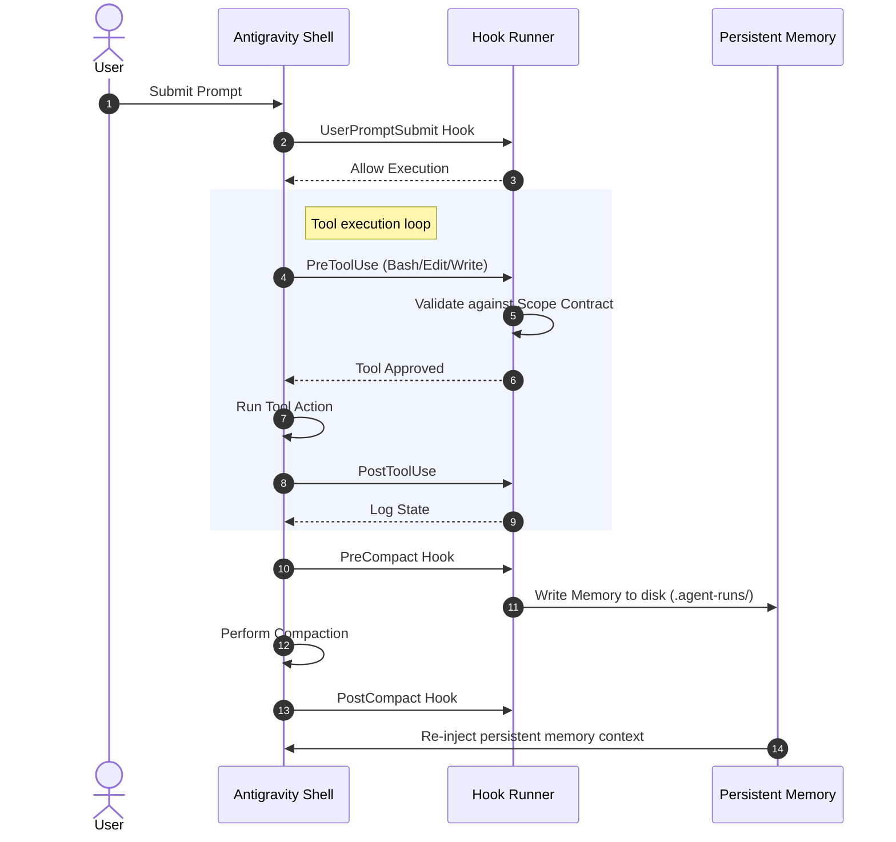

# Antigravity Agent Pipeline Suite - User Manual

This manual provides an in-depth operational guide, architectural blueprints, and command references for the **Antigravity Agent Pipeline Suite**. 

---

## 1. Architecture & Core Concepts

The pipeline suite is designed around three main pillars: **Enforcement Gating**, **Memory Continuity**, and **Cryptographic Constraints**.

### Execution Context & Lifecycle Hooks
The suite hooks directly into the host agent's Electron/Node-based shell lifecycle. By intercepting 11 core events, the suite enforces code constraints and prevents LLM drift during long software engineering sprints.

### Lifecycle Hooks Reference
1. **`SessionStart`**: Resolves the active run context, boots up the local Mem0 database container, and validates the workspace integrity.
2. **`UserPromptSubmit`**: Inspects user input. Blocked if a pipeline is locked/in-flight and user input deviates from approved keywords (`APPROVE`, `WAIT`, `CANCEL`).
3. **`PreToolUse`**: Matches requested files and actions against the active `scope-lock.yaml` file. Blocked if the tool attempts out-of-scope file modifications.
4. **`PermissionRequest`**: Intercepts requests for terminal commands or file reads. Denies dangerous commands.
5. **`PostToolUse`**: Captures changes, updates checksums, and tracks state changes.
6. **`PostToolUseFailure`**: Logs debugging contexts on tool errors.
7. **`PreCompact`**: Dumps active task histories, current milestones, and variables to the persistent cache directory.
8. **`PostCompact`**: Re-injects serialized data into the agent's short-term context window to prevent memory loss.
9. **`SubagentStop`**: Captures outputs of delegated subagents.
10. **`Stop`**: Enforces strict exit checks (checking that the manifest matches code outputs).
11. **`SessionEnd`**: Cleans up locks, logs run metrics, and updates local Mem0 memory stores.

---

## 2. Command Reference

### `/agent-pipeline-antigravity:pipeline-init`
Initializes a project directory to prepare for a multi-stage pipeline run.
* **Usage**: `/agent-pipeline-antigravity:pipeline-init [CWD | PRD-Path | Greenfield-Description]`
* **Behavior**:
  1. Inspects the repository (tests, specs, CI pipelines, and conventions).
  2. Generates an orientation summary.
  3. Displays a chat-gate decision prompt (e.g. `APPROVE` / `WAIT` / `CANCEL`).
  4. Scaffolds `.pipelines/`, configuration templates, and custom policy checkers in `scripts/policy/`.

---

### `/agent-pipeline-antigravity:run`
Executes, monitors, or resumes a multi-stage software engineering pipeline.
* **Usage**: `/agent-pipeline-antigravity:run [start | resume | status]`
* **Core Stages**:
  1. **Research**: Gathers facts about the repository, specs, and changes.
  2. **Plan**: Writes an `implementation_plan.md` and requests user approval.
  3. **Execute**: Makes changes to files, running checkers to verify steps.
  4. **Verify**: Runs test suites and confirms coverage.
  5. **Critique**: Self-audits against 5 quality lenses (Correctness, UX, Docs, Tests, Runtime).

---

### `/agent-pipeline-antigravity:mem0`
Manages the local cross-session Mem0 memory engine.
* **Subcommands**:
  * `init`: Creates default configuration files.
  * `up`: Spins up the local OSS Docker database containers.
  * `down`: Stops memory containers.
  * `whoami`: Resolves current session identities.
  * `test`: Verifies connection stability.

---

### `/audit-skills-antigravity:audit-lite`
Runs a fast, single-pass spot audit on a scoped code change or bug fix.
* **Usage**: `/audit-skills-antigravity:audit-lite`
* **Workflow**:
  1. Prompts for the scope (recent commit, PR, or diff).
  2. Reviews correctness, UX impact, documentation updates, and test additions.
  3. Generates a markdown report `audit-lite-<date>.md` with a detailed severity rollup (Blocker, Critical, Major, Minor, Nit).

---

### `/audit-skills-antigravity:audit-team`
Assembles a simulated multi-role expert team to conduct a comprehensive codebase audit.
* **Usage**: `/audit-skills-antigravity:audit-team`
* **Roles Simulated**:
  * **Staff Engineer**: Code quality, architectural patterns, complexity.
  * **Security Expert**: Gaps, sanitization, data leaks, credential storage.
  * **Lead UX**: Interaction flows, copy clarity, responsive design.
  * **Technical Writer**: Document freshness, API descriptions, error guides.
  * **Test Automation Lead**: Coverage gaps, flake risks, unit and E2E coverage.

---

## 3. Best Practices & Customization

### Configuring Custom Policies
You can enforce project-specific rules by editing the scaffolded checkers inside your repository's `scripts/policy/` directory:
* **`check_allowed_paths.py`**: Configure allowed write boundaries.
* **`check_no_todos.py`**: Refuse pipeline updates if code contains unresolved `TODO` markers.
* **`check_manifest_schema.py`**: Ensure metadata adheres strictly to schemas.

### Handling Gates
When the pipeline reaches a human-in-the-loop gate (such as plan approval), respond with:
* **`APPROVE`**: Proceed to the next stage.
* **`REPLAN`** or **`REVISE`**: Return to the planning/research stage with your feedback.
* **`VIEW`**: Output current stage state.
* **`CANCEL`**: Terminate the run.
